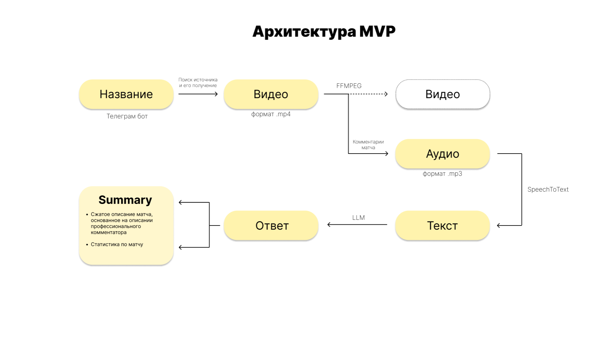

<h1>Yandex Sport Vision</h1>

<p align="center">
 <!--Py-->
</p>

Комментатор преобразует информацию о запрашиваемом спортивном событии текстового, аудио- или видеоформата в краткий содержательный текст с сопутствующей аналитикой, а также производит перевод на русский язык при необходимости *(в случае, если комментарии не на русском языке).*
<br>

<h2>Архитектура MVP</h2>



<br>

1. Телеграм бот на вход получает ссылку на YouTube-видео
2. Программа загружает файл с платформы YouTube
3. Аудио извлекается из полученного медиафайла
4. Извлеченное аудио переводится в текст, с помощью модели **SpeechToText**
5. Переданный текст комментариев эксперта передается в **LLM**, которая выдает `summary` (*сводку*) о происходящем в матче

<br>

<h2>How to contribute?</h2>

1. Сделать Fork этого репозитория, следуя инструкции здесь: https://shorturl.at/ctLck (*сокращенная ссылка на GitHub docs*)

2. Сделать Clone своего Fork с своего профиля:
```bash
git clone https://github.com/YOUR-USERNAME/ya-sport-vision
```
- В случае, если репозиторий с измнениями уже существует, стоит сделать `pull` для добавления свежих измнений в свой Fork

3. После доавбления своих изменений в Fork, создавайте Pull Request на основной репозиторий (https://github.com/plugg1N/ya-sport-vision) на Branch `test`

4. После согласования изменений - Pull Request будет одобрен, либо отправлен на переработку с комментариями
